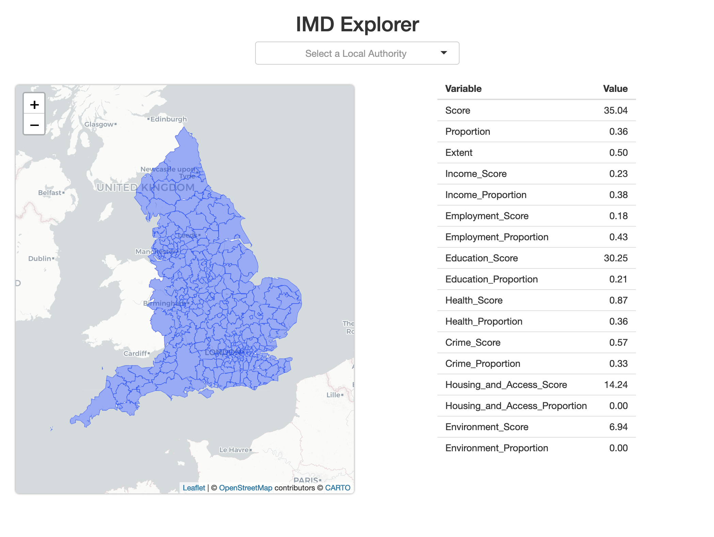

# VCSEP Coding Challenge

## Overview
One of the tasks of the Data Scientist role at the VCSEP (beside building interesting open source tools and R packages!) will be to maintain and expand the existing [R Shiny](https://shiny.rstudio.com/) web app the partnership uses to share insight.

In this repository we have built a small toy Shiny app (contained within `app.R`). The purpose of the app is to allow a user to a select a Local Authority District in England and view the associated Indices of Multiple Deprivation [IMD](https://www.gov.uk/government/statistics/english-indices-of-deprivation-2019) scores for that district. The app has three main components: (i) a map of English Local Authority Districts; (ii) a select box with a list of English Local Authority Districts; (iii) a table showing the IMD scores for the selected districts:

Currently, the app allows a user to click a Local Authority District on the map (i.e., a blue polygon), and the table updates to reflect the IMD scores for that district. The select box does nothing (yet!).

## The Challenge
Your task is to fix two bugs in the app and implement a new feature:
- **Bug one:** The app fails to run. `shiny::runApp("app.R")` returns an error to the R console.
- **Bug two:** Once the app is running, the IMD table on the right (see screenshot above) does not display.
- **Feature:** Connect the select box at the top of the page to the IMD table. The expected behaviour is that the user can select a Local Authority District from the map **or** the select box, and the IMD table should update. The user should be able to flick between the map and the select box without having to restart the app. Note: you will need to use Shiny's reactive programming model to implement this feature.

## Submission
1. Fork this repository
2. Implement the bug fixes and feature request listed above
3. Submit a pull request no later than 12:00pm GMT on 27th August 2021

## FAQ
*Where can I learn more about Shiny's reactive programming model?*

Chapters 3 & 13-16 of [Mastering Shiny](https://mastering-shiny.org/) are a good resource on this topic.

*Can I rebuild this app in Python?*

No. While we do use Python alongside R, the existing code base for the Insight platform is built in R, and it is a requirement for the role that you are able to maintain this. This does not mean future analyses cannot be written in Python (or your language of choice).
